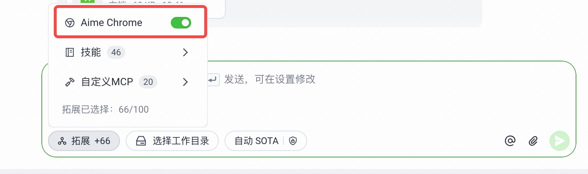

# 精品大店规划 Skill

[](https://github.com/leooooooliao/build-boutique-store-plan/releases)
[](https://github.com/leooooooliao/build-boutique-store-plan)
[](https://github.com/leooooooliao/build-boutique-store-plan/issues?q=is%3Aissue+label%3Ainstalled)

把同一客户分散在多个店铺里的已验证好品，重组为主题清晰的精品大店，并用营销参谋验证补品与内容渠道。

## 固定入口（以后都用这两个）

- **仓库首页与完整使用说明：** <https://github.com/leooooooliao/build-boutique-store-plan>
- **始终下载最新版本：** <https://github.com/leooooooliao/build-boutique-store-plan/releases/latest>

这两个链接不会随着版本升级而改变。`/releases/tag/v1.1.0` 一类链接只是某个历史版本的详情页，`/releases/download/v1.1.0/...` 一类链接只下载该固定版本，都不建议作为长期入口收藏。

**本 README 是唯一持续维护的使用说明。** 每次 Skill 流程调整，都会同步更新这里的业务背景、安装提示词、第一次使用提示词和浏览器授权说明；不会另起一个仓库保存新版说明。

## 为什么要做

东南亚、美区及其他跨境市场有大量跑品型商家。他们开品快、测品快，却也容易让好品散落在多个 `Shop ID` 中，每家店再持续叠加不同类目，最后形成多家定位模糊的“杂货店”。

这会把经营势能拆散：

- 成交、评价、素材和投放信号分散，难以形成单店复利。
- 消费者看不懂店铺主营什么，商品之间缺少自然连带。
- 达人找不到清晰的合作主题和可持续推广货盘。
- 大促缺少一个集中强品、内容和流量的主阵地。

这个 Skill 优先升级现有店铺：从全部货盘中识别已验证好品，按用户、场景和主题有机组合，再用营销参谋补齐结构性缺口。目标是把“跑品带量”沉淀成定位清晰、便于达人合作、能承接日常经营和大促流量的精品大店。

最终效果仍取决于库存、毛利、供应链、授权、履约和内容执行。本 Skill 提供可验证的店铺重组方案，不承诺 GMV。

方案排序优先体现真实跨店重组价值：若承接店内已经覆盖超过一半的候选 GMV 或商品原型，会标为“精修型”并默认后置；精修型仍可保留，但前置时必须给出可验证的主题纯度、经营强度或落地可行性理由。

[下载最新版本](https://github.com/leooooooliao/build-boutique-store-plan/releases/latest)｜[可选：登记一次成功安装](https://github.com/leooooooliao/build-boutique-store-plan/issues/new?template=install-registration.yml)

## 给任意 AI 的安装提示词

复制下面整段给 Aime、Mira 或其他 AI：

```text
请帮我下载、安装并启用“精品大店规划”Skill。

最新发布页：
https://github.com/leooooooliao/build-boutique-store-plan/releases/latest

请执行：
1. 下载最新 Release 中名为 build-boutique-store-plan-v*.zip 的文件。
2. 解压后完整保留 build-boutique-store-plan 文件夹，不要只复制 SKILL.md。
3. 有原生 Skill 功能时安装到可识别目录并重新加载；没有时以根目录 SKILL.md 为入口，按相对路径读取其引用文件。
4. 确认 SKILL.md、references/interaction.md、references/data-contract.md 可访问。
5. 安装完成后返回：是否成功、加载位置或方式，以及一段可直接复制的第一次使用提示词。
6. 无法联网、下载、解压或持久安装时，请说明限制并让我上传 ZIP，不得假装安装成功。
7. 完整报告必须实际查询营销参谋，不能因找不到另一个 Skill、浏览器未授权或页面操作困难而静默跳过；应先提示我开启本地浏览器能力。
8. 只有我确认安装成功且你具备 GitHub 写入能力时，才询问是否自愿登记一次安装；不要重复登记。
```

## 第一次使用

复制这一段：

```text
请使用 $build-boutique-store-plan，为【客户/集团名称】做精品大店规划。
先不要分析，请按 Skill 的首次交互提示我开启本地浏览器，并告诉我如何提供两份完整表格和两个准确时间窗口。完整报告必须包含营销参谋补品验证。
```

AI 的第一条回复应先完成浏览器预检，再提供两个拉数入口。两个报表都要把“商家”改成同一个目标商家：

1. ID 层级数据：经营指标的唯一事实源。
2. 名称对照数据：只用于理解商品名和具体店铺名。

推荐把两张完整表复制到同一个 Excel 的两个 Sheet 后上传。也可以直接在对话中分两段粘贴，并分别标注 `ID层级`、`名称对照`。两种方式都要保留完整表头和全量行，不要发截图。

报表跑出来是什么样就保持什么样。不要补 L3、cost、名称或国家空值，也不要手动清洗、改数或换算。国家由 AI 自动识别；客户/集团名称和具体 `shop_name` 不同属于正常情况。

只需额外提供：

- 客户/集团名称；
- 客户货盘准确起止日；
- 营销参谋准确起止日。

表格不要截图，`Shop ID` 和 `Product ID` 必须保持文本。

## Aime 与 Mira 的浏览器授权

### Aime

开始前，点击输入框下方【拓展】，开启截图中的 **Aime Chrome**；这就是开关的实际名称。使用当前已经登录营销参谋的本地浏览器，**不要选择云端浏览器授权**。



授权和登录完成后，AI 应自动切换营销参谋的国家、类目和周期。GCRM 的类目框是自定义级联下拉框，Skill 已内置 DOM 定位与浮层内自动滚动协议；正常情况下不需要你为每个国家、每个类目反复手选。

### Mira 或其他 AI

按当前 AI 的真实界面开启本地浏览器操作能力，并使用已经登录营销参谋的浏览器；AI 应给出它能确认的一步操作，不知道按钮名称时不要编造。界面名称可以不同，但原则相同：安装 Skill 不等于已经获得浏览器能力，完整报告必须实际查询并保留营销参谋证据。

若浏览器未授权或未登录，AI 应只提示一次明确操作并在完成后重试；不得让使用者逐组手动切换国家和类目。所有安全路径都失败时，只能交付醒目标注的“精品店方案部分草稿｜营销参谋待完成”，不能称为完整精品店方案。

## 不同能力怎么适配

| AI 能力 | 使用方式 |
|---|---|
| 支持本地 Skills | 安装完整文件夹，重新加载后用 Skill 名称触发 |
| 能下载和读文件但没有 Skills | 保留完整目录，以 `SKILL.md` 为入口执行 |
| 只有聊天和上传能力 | 手动下载 ZIP 并上传；可能只在当前对话有效 |
| 能操作本地登录浏览器 | 完成营销参谋验证并生成完整报告 |
| 暂时不能操作本地浏览器 | 先解决授权或登录；用户决定停止时只能交付精品店方案部分草稿 |

## 统计口径

- `Release ZIP downloads`：GitHub Release 附件累计下载事件，不是独立用户或安装人数。
- `README views`：徽章请求次数，可能包含刷新、机器人或重复访问。
- `registered installs`：使用者自愿提交的安装登记数，不代表全部实际安装。
- GitHub 仓库 Traffic 仅向有写入权限的人展示最近 14 天，因此不把它写成公开累计浏览量。

公开 Skill 保留工作所需入口，但链接本身不授予访问权限。任何 AI 都不得绕过组织登录或既有权限。
